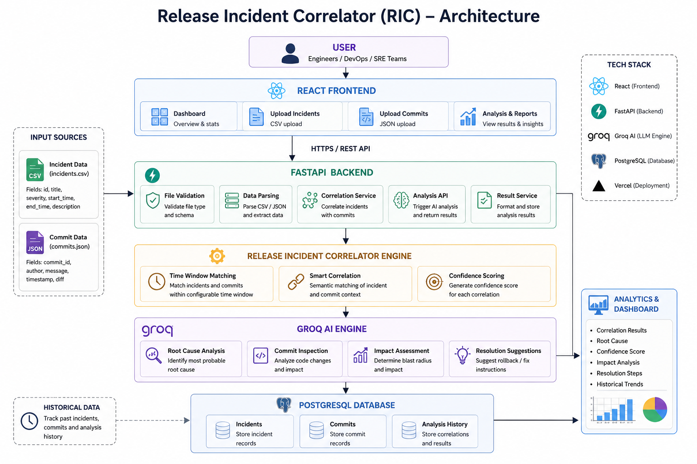
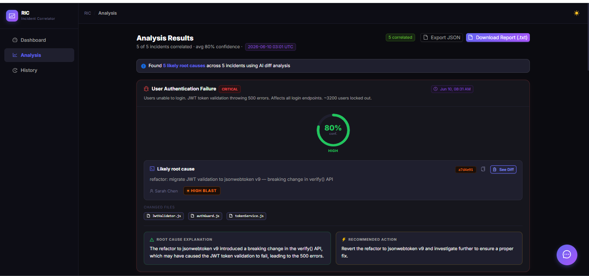
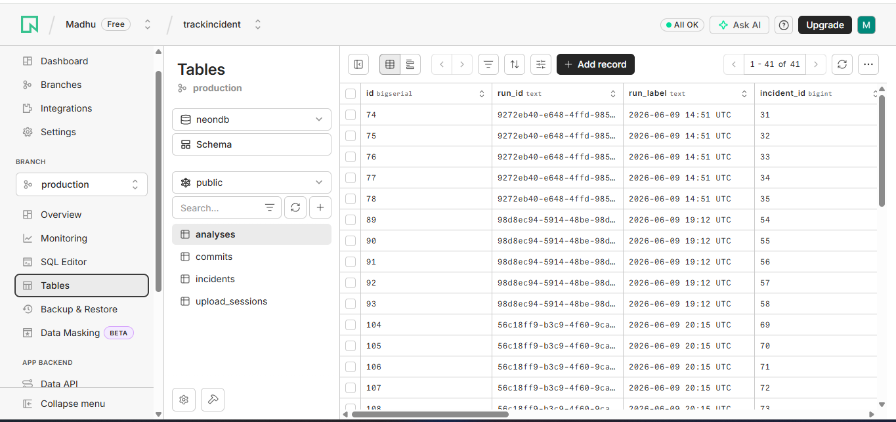

# Release Incident Correlator

## Team
- **Team Name:** Tech Titans
- **Team Members:**
  1. **Abinaya S** – [Resume](./resumes/ABINAYA%20S%20RESUME.pdf)
  2. **Dhivya V** – [Resume](./resumes/DHIVYA%20V%20RESUME%20Final.pdf%20(1).pdf)
  3. **Madhumitha G** – [Resume](./resumes/Madhumitha%20G%20resume.pdf)
  4. **Velmani R** – [Resume](./resumes/Velmani_R_FlowCV_Resume_2026-06-10%20(2).pdf)

## Project Title
**Release Incident Correlator**

### Brief Description
An AI‑driven platform that automatically ingests incident logs and code commits, correlates them, performs root‑cause analysis, and generates actionable mitigation recommendations, drastically reducing MTTR.

## Deployment
- **Frontend:** <https://track-incident.vercel.app/> (deployed on Vercel)
- **Backend:** Hosted on Render

## Live Demo
[Watch the full working demo](https://youtu.be/fMzumygK6kQ?si=fATBtJIHJz0Q3VEJ)

## Features
- Incident Detection
- Incident Correlation (time‑window filtering)
- Root Cause Analysis
- AI‑Powered Recommendations
- Severity Classification
- Dashboard & Analytics
- Historical Trend Analysis
- Incident Timeline Tracking
- Search & Filtering
- Data Visualization (Framer Motion)
- CSV Import Processing
- Automated Incident Grouping

## Tech Stack
**Frontend**
- React
- Vite
- Tailwind CSS
- Shadcn UI
- Framer Motion

**Backend**
- Python
- Flask
- Pandas
- PostgreSQL

## AI Usage Document
[AI Usage Note](./document/RELEASE%20INCIDENT%20CORRELATOR.pdf)

## Architecture Diagram

## Workflow Overview
1. **Upload** incident logs and commit histories via the dashboard.
2. **Pre‑process** data and apply a deterministic time‑window filter to narrow candidate commits.
3. **Prompt Construction:** format incident context and candidate diffs for the Groq‑hosted LLM.
4. **Inference:** LLM returns confidence scores, blast radius, explanations, and remediation steps.
5. **Store Results** in PostgreSQL and display them on the analytics dashboard.

## Screenshots
### Landing page

### Enterprises

### Working

### Dashboard

### Result

### History

### AI Interface

## Database Screenshots
### Tables

### Incident DB

### Incident 2

## Conclusion
The Release Incident Correlator demonstrates how modern AI models, combined with efficient engineering practices, can transform incident management from a manual, time‑consuming process into an automated, intelligent workflow that accelerates resolution and improves system reliability.
