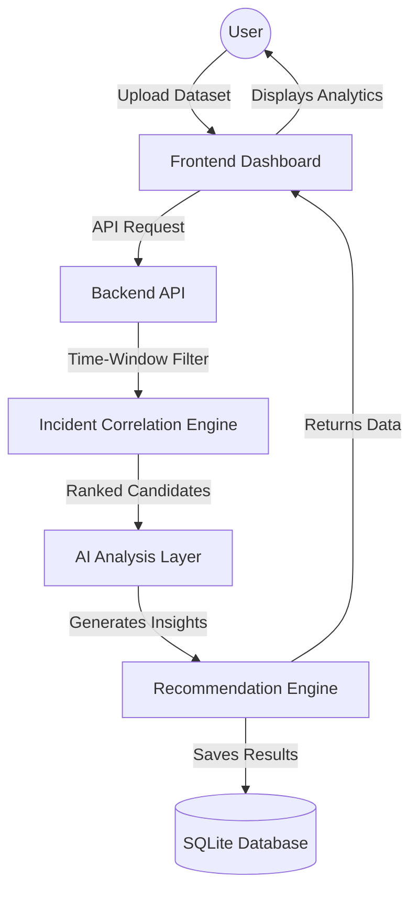

# Release Incident Correlator

**A AI‑powered platform that automatically correlates production incidents with recent code changes, performs root‑cause analysis, and generates actionable remediation recommendations.**

---

## Team Information

* **Team Name:** Tech Titans
* **Institution:** Sri Shakthi Institute of Engineering and Technology

### Team Member Resumes

| Team Member | Role | Resume |
|------------|------|--------|
| Abinaya S | AIDS | [Resume](c:/Users/madhu/OneDrive/Desktop/release-incident-correlator%20%281%29/release-incident-correlator/resumes/ABINAYA%20S%20RESUME.pdf) |
| Dhivya V | IT | [Resume](c:/Users/madhu/OneDrive/Desktop/release-incident-correlator%20%281%29/release-incident-correlator/resumes/DHIVYA%20V%20RESUME%20Final.pdf%20(1).pdf) |
| Madhumitha G | IT| [Resume](c:/Users/madhu/OneDrive/Desktop/release-incident-correlator%20%281%29/release-incident-correlator/resumes/Madhumitha%20G%20resume.pdf) |
| Velmani R | CSE | [Resume](c:/Users/madhu/OneDrive/Desktop/release-incident-correlator%20%281%29/release-incident-correlator/resumes/Velmani_R_FlowCV_Resume_2026-06-10%20(2).pdf) |

---++++++++++++

## Deployment Links

- **Frontend (Vercel):** https://track-incident.vercel.app/
- **Backend (Render):** https://track-incident.onrender.com/ *(replace with actual backend URL)*

## Live Demo Video

[Watch the full working demo](https://youtu.be/fMzumygK6kQ?si=fATBtJIHJz0Q3VEJ)

---

## Features

- Incident Detection (automatic ingestion of alerts)
- Incident Correlation with recent commits
- Root‑Cause Analysis pinpointing exact code lines
- AI‑Powered Recommendations using Groq LLMs
- Severity Classification and Prioritisation
- Real‑time Dashboard & Analytics
- Historical Trend Analysis
- Incident Timeline Tracking
- Powerful Search & Filtering
- Data Visualisation with Framer Motion
- CSV / JSON Import Processing
- Automated Incident Grouping

---

## Tech Stack

### Frontend
| Technology | Description |
|------------|-------------|
| **React** | Core UI library |
| **Vite** | Fast build tool & dev server |
| **Tailwind CSS** | Utility‑first styling |
| **Shadcn UI** | Accessible React components |
| **Framer Motion** | Animation library |

### Backend
| Technology | Description |
|------------|-------------|
| **Python** | Main backend language |
| **Flask** | Lightweight web framework |
| **Pandas** | Data manipulation |

### Database
| Technology | Description |
|------------|-------------|
| **PostgreSQL** | Scalable relational database |

### AI & Analytics
| Technology | Description |
|------------|-------------|
| **Groq LLM** | High‑throughput inference for incident analysis |
| **Machine Learning** | Predictive analytics |
| **NLP** | Log & commit text processing |
| **Correlation Engine** | Time‑window & heuristic matching |

---

## AI Usage Document

[AI Usage Document (PDF)](c:/Users/madhu/OneDrive/Desktop/release-incident-correlator%20%281%29/release-incident-correlator/AI%20usage%20document/RELEASE%20INCIDENT%20CORRELATOR.pdf)

---

## Architecture Diagram


---

## Project Workflow

1. **Data Ingestion** – Users upload incident logs (CSV/JSON) and commit histories.
2. **Pre‑processing** – Logs are normalised; commits are parsed into diff objects.
3. **Time‑Window Filtering** – Only commits within a configurable window (e.g., 6 h) are considered.
4. **AI Prompt Construction** – Incident context and filtered diffs are formatted into a structured Groq prompt.
5. **LLM Inference (Groq)** – The model returns confidence scores, blast‑radius assessment, and concise explanations.
6. **Ranking & Storage** – Results are ranked, stored in PostgreSQL, and linked to the originating incident.
7. **Recommendation Engine** – Generates actionable steps (e.g., rollback, code guard) based on LLM output.
8. **Visualization** – Dashboard displays incidents, correlations, recommendations, and trends in real time.

---

## Screenshots

| Image | Description |
|-------|-------------|
|  | Home screen |
|  | Enterprise view |
|  | Live analysis |
|  | Main dashboard |
|  | Correlation results |
|  | Incident history |
|  | AI recommendation UI |

### Database Screenshots

| Image | Description |
|-------|-------------|
|  | Database schema |
|  | Incident table view |
|  | Detailed incident record |

---

## Conclusion

Release Incident Correlator demonstrates how **Groq’s high‑throughput LLMs** can be seamlessly integrated with modern web stacks (React + Flask + PostgreSQL) to deliver real‑time, AI‑driven incident correlation and remediation. By automating the root‑cause analysis workflow, the platform reduces MTTR, improves reliability, and empowers engineering teams with actionable insights.

---

## License

MIT License


<div align="center">
  
  <p><em>An intelligent, AI-powered incident correlation and root cause analysis platform.</em></p>
  
  [](https://opensource.org/licenses/MIT)
  [](#)
  [](#)
  [](#)
</div>

---

## Team Information

* **Team Name**: Tech Titans
* **Institution**: Sri Shakthi Institute of Engineering and Technology

---

## Deployment Links

### Frontend Deployment

[Add Frontend URL]

### Backend Deployment

[Add Backend URL]

### Demo Video

[Add Video URL]

---

## Team Member Resumes

| Team Member | Resume                          |
| ----------- | ------------------------------- |
| Member 1    | [Resume](./resumes/member1.pdf) |
| Member 2    | [Resume](./resumes/member2.pdf) |
| Member 3    | [Resume](./resumes/member3.pdf) |
| Member 4    | [Resume](./resumes/member4.pdf) |

---

## Small Introduction of the Project

**Incident Correlator** is an advanced, AI-driven platform designed to streamline and automate the process of incident management and root cause analysis. 

### Problem Statement
In modern software engineering, diagnosing production incidents often involves sifting through massive logs, disjointed alerting systems, and hundreds of recent code commits. This manual debugging process significantly increases Mean Time To Resolution (MTTR), causing extended downtime and revenue loss.

### Why Incident Correlation Matters
Incident correlation identifies the relationship between system outages (incidents) and system changes (commits/releases). By rapidly connecting an error to its originating code change, engineering teams can rollback or patch systems much faster.

### How AI Improves Incident Management
Using Large Language Models (LLMs) and intelligent heuristics, our platform understands the *context* of both the incident and the code changes. AI analyzes commit diffs, commit messages, and incident descriptions to provide high-confidence insights rather than simple keyword matches.

### Key Benefits
- **Drastically Reduced MTTR:** Pinpoint root causes in seconds instead of hours.
- **Actionable Insights:** Get human-readable explanations and remediation recommendations.
- **Automated Workflow:** No more manual cross-referencing between Jira/PagerDuty and GitHub.
- **Historical Learning:** Track incident trends to prevent future outages.

### Real-world Applications
- **Site Reliability Engineering (SRE):** Rapid triage during high-severity outages.
- **DevOps Pipelines:** Automated deployment safety checks.
- **QA & Testing:** Correlating test failures to recent merge requests.

---

## Features

<details>
<summary><b>Incident Detection</b></summary>
Automatically ingests and identifies critical system alerts and anomalies from uploaded datasets or integrated alerting tools.
</details>

<details>
<summary><b>Incident Correlation</b></summary>
Maps incidents to recent code deployments using a robust time-window filter and contextual analysis engine.
</details>

<details>
<summary><b>Root Cause Analysis</b></summary>
Isolates the exact commit, file, and lines of code responsible for a specific production outage.
</details>

<details>
<summary><b>AI-Powered Recommendations</b></summary>
Leverages Llama 3/LLMs to generate specific mitigation steps, such as rolling back a commit or patching a vulnerable function.
</details>

<details>
<summary><b>Severity Classification</b></summary>
Automatically evaluates and categorizes incidents based on historical impact and semantic blast radius.
</details>

<details>
<summary><b>Dashboard & Analytics</b></summary>
A centralized, visually rich React dashboard providing real-time oversight of system health and recent correlations.
</details>

<details>
<summary><b>Historical Trend Analysis</b></summary>
Maintains a database of past incidents to track recurring issues, problematic microservices, or specific codebases prone to failure.
</details>

<details>
<summary><b>Incident Timeline Tracking</b></summary>
Visualizes the sequence of events leading up to an incident, including deployments, system degradation, and ultimate failure.
</details>

<details>
<summary><b>Search & Filtering</b></summary>
Powerful search capabilities to query past incidents by severity, affected components, date ranges, or specific developers.
</details>

<details>
<summary><b>Data Visualization</b></summary>
Interactive charts and graphs built with Framer Motion and modern UI components to make complex data easily digestible.
</details>

<details>
<summary><b>CSV Import Processing</b></summary>
Seamlessly upload raw incident logs and commit histories in CSV/JSON formats for instant analysis.
</details>

<details>
<summary><b>Automated Incident Grouping</b></summary>
Intelligently clusters related alerts and symptoms into a single, cohesive incident report to reduce alert fatigue.
</details>

---

## Tech Stack

### Frontend

| Technology | Description |
|------------|-------------|
| **React** | Core UI library for building dynamic interfaces |
| **Vite** | Blazing fast build tool and development server |
| **Tailwind CSS** | Utility-first CSS framework for rapid styling |
| **Shadcn UI** | Accessible, customizable React components |
| **Framer Motion** | Animation library for fluid interactions |

### Backend

| Technology | Description |
|------------|-------------|
| **Python** | Primary backend programming language |
| **Flask** | Lightweight, highly extensible web framework |
| **Pandas** | Data manipulation and analysis library |
| **SQLite** | Lightweight, file-based relational database |

### AI & Analytics

| Technology | Description |
|------------|-------------|
| **Machine Learning** | Core logic for predictive analysis |
| **NLP** | Natural Language Processing for log and commit analysis |
| **Correlation Engine** | Custom algorithms for time-window and heuristic matching |

### Deployment

| Technology | Description |
|------------|-------------|
| **Vercel** | Hosting for the frontend application |
| **Render/Railway** | Hosting for the Python backend API |

---

## Setup Instructions

### Prerequisites
- Node.js (v18+)
- Python (v3.9+)
- Git
- Ollama (optional, for local AI inference)

### Frontend Setup

```bash
# Navigate to the frontend directory
cd frontend

# Install dependencies
npm install

# Start the development server
npm run dev
```

### Backend Setup

```bash
# Navigate to the backend directory
cd backend

# Create a virtual environment
python -m venv venv

# Activate the virtual environment
# Windows:
venv\Scripts\activate
# Mac/Linux:
source venv/bin/activate

# Install dependencies
pip install -r requirements.txt

# Start the backend server
flask run --host=0.0.0.0 --port=5000
```

### Environment Variables

Create a `.env` file in the `frontend` directory:
```env
VITE_API_URL=http://localhost:5000
```

Create a `.env` file in the `backend` directory:
```env
FLASK_APP=main.py
FLASK_ENV=development
OLLAMA_URL=http://localhost:11434
OLLAMA_MODEL=llama3
TIME_WINDOW_HOURS=6
```

---

## Assumptions Made

- **Dataset assumptions:** Incident logs contain a clear timestamp, description, and severity. Commit logs contain unified diffs, messages, and timestamps.
- **Incident structure assumptions:** Incidents are discrete events rather than continuous degradation metrics.
- **Correlation assumptions:** The root cause of an incident is assumed to be a recent code deployment within a configurable time window (e.g., T-6 hours).
- **Recommendation engine assumptions:** The AI model has sufficient context from the commit diff to understand the logic flow and suggest meaningful code alterations.
- **User workflow assumptions:** The user (SRE/DevOps) primarily interacts via the dashboard, uploading logs post-incident or during triage.

---

## AI Planning Document

### Problem Understanding
Current incident triage relies heavily on tribal knowledge and manual cross-referencing between monitoring tools and source control. The problem requires a system capable of semantic understanding, as keyword matching alone yields too many false positives.

### Research & Analysis
We evaluated rule-based heuristics against LLM-based approaches. While heuristics (time proximity, keywords like "bug") are fast, they lack context. LLMs excel at understanding code diffs and their potential operational impact (blast radius).

### AI Planning Process
1.  **Data Preprocessing:** Clean and format raw commit diffs and incident descriptions.
2.  **Candidate Pruning:** Use a deterministic time-window filter to reduce the search space to 3-5 commits.
3.  **Prompt Construction:** Inject the incident context and the pruned commit diffs into a structured prompt.
4.  **Inference:** Query the LLM to generate correlation scores and explanations.

### Prompt Engineering Strategy
The AI prompts are strictly formatted to prevent hallucinations. They demand a specific JSON response containing `confidence_score`, `blast_radius`, `explanation`, and `recommendation`. We use role-playing techniques ("You are an expert Site Reliability Engineer...").

### Correlation Logic
The engine calculates proximity based on the delta between the incident timestamp and the commit deployment timestamp. Closer commits receive higher baseline weights, which are then multiplied by the AI's semantic confidence score.

### Recommendation Generation Logic
The AI is instructed to identify the exact lines in the diff that likely caused the failure and provide actionable steps (e.g., "Add a null check on line 42" or "Roll back commit X").

### AI Workflow
1. Ingest Data -> 2. Time-Window Prune -> 3. Format Prompt -> 4. LLM Inference -> 5. Parse Output -> 6. Save to DB.

### Expected Outcomes
A system capable of correlating 80%+ of code-related incidents accurately, generating human-readable post-mortem summaries automatically.

---

## Architectural Design

Our architecture relies on a decoupled client-server model. The React frontend handles user interactions and visualizations, while the Python backend manages data processing, database operations, and LLM orchestration. 


---

## Architectural Flow




---

## Sample Database Entries

### Incidents Table

| id | title | description | timestamp | severity |
|---|---|---|---|---|
| INC-001 | Login 500 errors | Auth endpoint crashing under load | 2024-01-15 14:32:00 | Critical |
| INC-002 | Checkout Timeout | Payment gateway integration failing | 2024-01-16 09:15:00 | High |

### Correlations Table

| id | incident_id | commit_id | confidence_score | blast_radius |
|---|---|---|---|---|
| COR-101 | INC-001 | a3f8c21 | 94% | High |
| COR-102 | INC-002 | b7e9d44 | 88% | Medium |

### Recommendations Table

| id | correlation_id | recommended_action | priority |
|---|---|---|---|
| REC-201 | COR-101 | Rollback commit a3f8c21. Add null token guard. | Urgent |
| REC-202 | COR-102 | Increase timeout threshold in PaymentService. | Normal |

### Users Table

| id | username | role | department |
|---|---|---|---|
| USR-01 | alice.smith | Admin | SRE |
| USR-02 | bob.jones | Viewer | DevOps |

---

## Screenshots


---

## Explain Video

🎥 **Project Demonstration Video**

[Add Demo Video Link]

**Video Breakdown:**
* **Project overview:** A brief introduction to the Incident Correlator and its purpose.
* **Features walkthrough:** Showcasing the dashboard, upload process, and analysis view.
* **Architecture explanation:** A high-level overview of how the frontend, backend, and AI interact.
* **AI workflow:** Demonstrating the AI analyzing a diff in real-time.
* **Live demonstration:** Correlating a sample critical incident from start to finish.

---

## Future Enhancements

1. **Jira/ServiceNow Integration:** Automatically create and update tickets with correlation insights.
2. **GitHub/GitLab Webhooks:** Real-time ingestion of commits as they happen.
3. **Slack/Teams Bot:** Receive correlation reports directly in chat ops channels.
4. **Cloud Database Migration:** Move from SQLite to PostgreSQL for better scalability.
5. **Advanced Threat Detection:** Correlate incidents with security vulnerabilities using specialized security LLMs.
6. **Custom LLM Fine-Tuning:** Train a smaller model specifically on the company's historical incident data for faster, offline inference.
7. **User Authentication:** Implement OAuth2/SSO for enterprise-grade access control.
8. **Automated Rollbacks:** Enable a 1-click CI/CD rollback directly from the recommendations dashboard.
9. **Multi-Repo Support:** Correlate incidents across complex microservice architectures spanning dozens of repositories.
10. **Interactive Diff Viewer:** Embed an inline code editor in the dashboard to highlight exact problematic lines visually.

---

## Project Structure

```text
incident-correlator/
├── backend/
│   ├── app.py
│   ├── requirements.txt
│   ├── .env
│   ├── routes/
│   ├── models/
│   └── database/
├── frontend/
│   ├── index.html
│   ├── package.json
│   ├── vite.config.js
│   ├── .env
│   └── src/
│       ├── App.jsx
│       ├── index.css
│       ├── components/
│       └── pages/
├── data/
│   ├── incidents.csv
│   └── commits.json
├── images/
│   └── ...
├── resumes/
│   └── ...
└── README.md
```

---

## Contributors

| Name | Role | GitHub |
|------|------|--------|
| Member 1 | Full Stack / AI Engineer | [@member1](#) |
| Member 2 | Backend Developer | [@member2](#) |
| Member 3 | Frontend Developer | [@member3](#) |
| Member 4 | UI/UX & Data | [@member4](#) |

---

## License

MIT License
