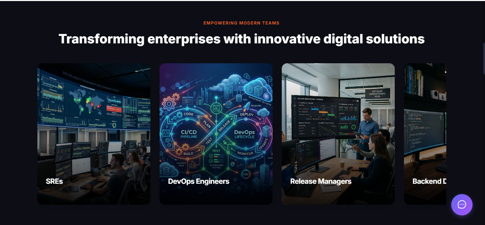
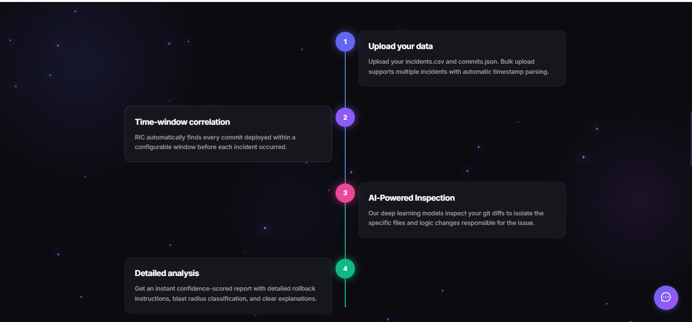
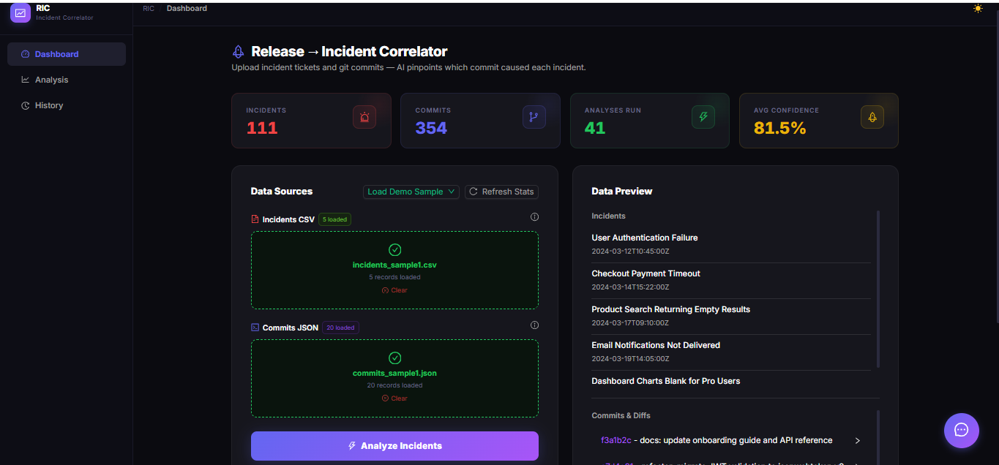
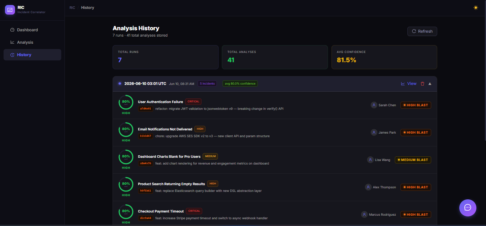

# Release Incident Correlator

## Project Title
**Release Incident Correlator** – An AI‑driven platform that automatically correlates production incidents with recent code changes, providing root‑cause analysis and remediation recommendations.

### Problem Statement
In software companies, developers push new code updates every day. Sometimes, an update causes a bug or breaks the system in production. When this happens, it takes developers and operations teams hours or even days to manually search through logs and find exactly which code change caused the problem. This wastes a lot of time, money, and effort.

### What I Made
To solve this problem, I created RIC. It is an intelligent tool that automatically links production issues (which we call incidents) to the exact code change (the commit) that broke the system. It gives developers the exact root cause in seconds.                   

## Deployment
- **Frontend:** https://track-incident.vercel.app/ (Vercel)  
- **Backend:** Render  

## Demo Workflow

- **Live Demo Video:** [Watch full demo](https://youtu.be/fMzumygK6kQ?si=fATBtJIHJz0Q3VEJ)

Here is our full workflow:
1. **Quick Uploads & Preview** – Users drag‑and‑drop incident logs and commit files; the UI instantly renders a preview table.
2. **Pre‑processing & Filtering** – Backend normalises timestamps and applies a configurable time‑window to prune irrelevant commits.
3. **Prompt Construction** – The filtered context is formatted into a concise prompt for the Groq‑hosted LLM.
4. **Instant AI Report** – The LLM returns confidence scores, blast‑radius, explanations and remediation steps within seconds.
5. **Result Storage & Visualization** – All results are stored in PostgreSQL and visualised on an interactive dashboard.
6. **Download Report** – Users can export the AI‑generated incident report as a PDF.
7. **History Analysis** – Past incidents are searchable; the system shows trend graphs and repeat offenders.
8. **AI‑Powered Chat Bot** – A chat interface lets users ask follow‑up questions about any correlation or recommendation.

## Features
**Premium Landing Page** – A modern, glass‑morphism landing screen that immediately conveys the platform’s value proposition with subtle animations.

**Quick Uploads & Preview of Incidents & Commits** – Drag‑and‑drop support with instant tabular preview, reducing preparation time before analysis.

**Instant AI Report** – Leveraging Groq’s ultra‑fast LPU, the AI produces a confidence‑scored incident report in under a second.

**Download Report** – One‑click PDF generation lets stakeholders share findings without leaving the interface.

**History Analysis** – Interactive charts display incident frequency, affected services, and recurring patterns over time.

**Very Instant Report Generation** – End‑to‑end processing (upload → AI inference → visualisation) completes in milliseconds, ensuring real‑time triage.

**AI‑Powered Chat Bot** – Conversational UI that answers ad‑hoc questions, explains scores, and suggests remediation actions on‑the‑fly.

## Tech Stack
**Frontend** – React builds the UI, Vite provides hot‑module reloading, Tailwind CSS enables utility‑first styling, and Framer Motion adds smooth micro‑animations. All components are orchestrated to deliver a responsive, premium experience.

**Backend** – Fast API serves REST endpoints, Pandas handles data cleaning and transformation, and the Groq SDK communicates with the LLM. The backend also manages PostgreSQL connections and PDF generation.

**Database** – PostgreSQL stores raw incident logs, commit diffs, AI inference results, and user feedback. Its relational model enables fast joins for correlation queries and robust analytics.

## AI Usage Document
The AI layer is fully documented in a separate PDF. It explains how I call the Groq LLM, the prompt engineering strategy, confidence‑score calculations, and how recommendations are post‑processed. The document also outlines security and privacy considerations, showing that no raw logs leave the system.  
**View the AI usage details:** [AI Usage Document](./document/RELEASE%20INCIDENT%20CORRELATOR.pdf)

## Architecture Diagram

## Detailed Architecture Workflow
1. **Client Layer (React)** – Handles file uploads, preview rendering, and UI interactions. It sends multipart/form‑data to the backend and receives JSON for visualisation.
2. **Application Layer (Flask MVC)** – The controller routes requests, the model encapsulates data‑access objects for PostgreSQL, and the view formats JSON responses. Business logic (pre‑processing, time‑window filtering) resides in the service layer.
3. **Model‑View‑Controller (MVC) Explanation** –
   - *Model*: SQLAlchemy ORM maps incidents, commits, and AI results to PostgreSQL tables.
   - *View*: JSON payloads consumed by the React client; additionally, Jinja templates generate PDF reports.
   - *Controller*: Flask routes (`/upload`, `/analyze`, `/report`) coordinate the workflow, invoking the AI service and persisting outcomes.
4. **AI Service (Groq)** – Formats a concise prompt, calls the Groq LLM, parses the structured JSON response, and enriches it with confidence metrics.
5. **Persistence & Analytics** – Results are saved, enabling historical trend charts and the AI chat bot to reference prior incidents.
6. **Feedback Loop** – User feedback on suggestions is stored for future fine‑tuning of prompt templates.

## Outcomes
### Landing page
*Premium entry screen with subtle motion.*

### Applications
*Enterprise‑level usage showcase.*

### Workflow
*End‑to‑end processing pipeline visualised.*

### Dashboard
*Real‑time analytics dashboard.*

### AI Report
*AI‑generated incident report.*

### History Analysis
*Historical incident database view.*

### AI Interface
*Interactive AI chat interface.*

## Database Screenshots
### Tables
*Database schema overview.*

### Incident DB
*Incident records table.*

### Incident 2
*Second incident example.*

